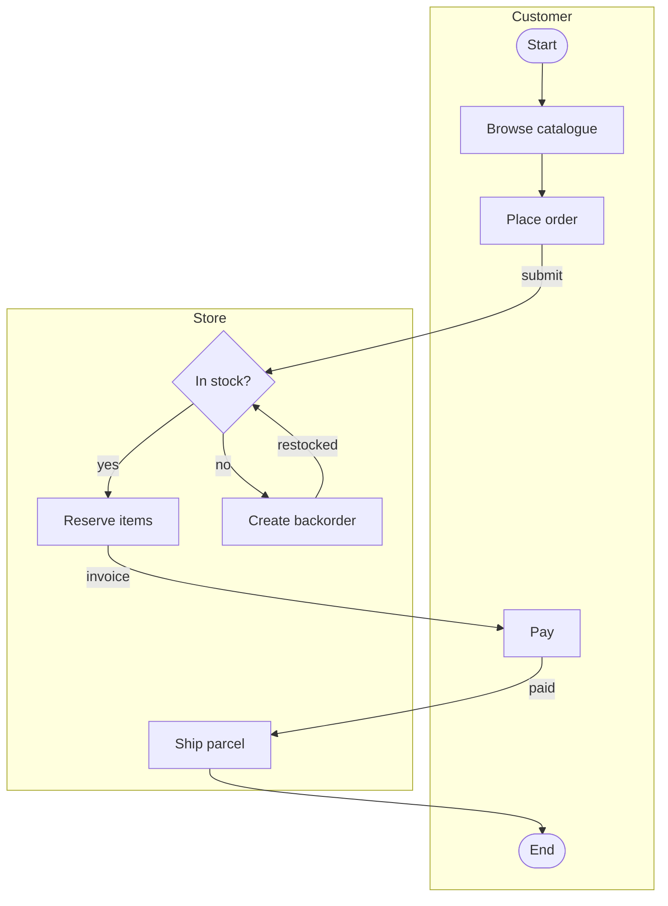

# drawio-digest

Extract the structure of a `.drawio` diagram as **Mermaid** or **JSON**.

`.drawio` files are XML, but they are XML describing a *canvas* — shapes and
coordinates, not meaning. That makes them awkward to diff in review, and
opaque to scripts and LLMs. `drawio-digest` reads the geometry and recovers
the structure: nodes, edges, labels, and lanes.

```bash
drawio-digest flow.drawio              # -> flow.md    Markdown + Mermaid
drawio-digest flow.drawio -f mermaid   # -> flow.mmd   bare diagram source
drawio-digest flow.drawio -f json      # -> flow.json  structured data
drawio-digest *.drawio --summary       # one short block per diagram
cat flow.drawio | drawio-digest -      # stdin
```

It is a plain CLI, which means both you and a coding agent can use it —
Claude Code, Codex and friends already know how to run shell commands, so
no plugin or integration is required.

## Why not just read the XML?

Because draw.io is a free-form canvas, several things that look structural on
screen are not structural in the file. This tool handles the cases that bite:

| In the file | What it means | What naive parsing does |
|---|---|---|
| A large titled rectangle holding other shapes | A swimlane | Emits it as a giant node |
| A `vertex` with `edgeLabel` style | A label *on an edge* | Emits a floating node, edge loses its label |
| An edge with no `source` | Endpoint dropped on a connection point, not inside the shape — **looks attached on screen** | Silently loses the edge |
| `endArrow=none` | A divider or annotation | Emits a phantom connection |

The third one is the nasty one. draw.io renders it identically to a real
connection, so it is invisible until something tries to read the file.
`drawio-digest` reattaches such an endpoint when the stored coordinate lies
on or within `20px` of a shape, and **flags it for review** rather than
fixing it silently:

```
> ℹ️ These connections were not bound to a shape in the source file and were
> reattached by coordinate. Please verify:
> - Place order -> In stock? (submit)
```

If an endpoint is too far from anything to be certain, the edge is **dropped
and reported** — never guessed:

```
> ⚠️ These connections have an unattached endpoint that could not be resolved
> and were skipped. Please check them:
> - Ship parcel -> ?
```

The right fix is in the source diagram: drag the endpoint until the *whole
shape* highlights, not just a connection point. This tool tells you where.

## Install

```bash
pip install drawio-digest
```

Requires Python 3.8+. No dependencies.

## Usage

```
drawio-digest FILE... [options]        # FILE may be - for stdin

  -f, --format {markdown,mermaid,json}  output format (default: markdown)
  -o, --outdir DIR                      output directory (default: alongside source)
      --stdout                          print instead of writing files
      --summary                         short overview instead of converting
      --direction {TD,LR,BT,RL}         mermaid flow direction (default: TD)
      --no-notes                        omit notes about recovered/dropped edges
      --strict                          exit non-zero if any edge was dropped
```

**Formats.** `markdown` is a ready-to-read document — a `# title`, a fenced
mermaid block per page, and any review notes. `mermaid` is the bare diagram
source, for pasting into a document you already have. `json` is the full
model, for scripts.

**`--summary`** answers *"is this diagram worth opening?"* in a few lines,
which is the cheap first step when scanning a repository:

```
$ drawio-digest examples/*.drawio --summary
order-review
Page 1: 9 nodes, 9 edges, 2 lanes
  lanes: Customer(5), Store(4)
  entry: Start
  exit: End
```

Nodes that touch no edge are reported as `unconnected` rather than counted
as entry and exit points — legends and date markers are common in real
diagrams and would otherwise misdescribe the flow.

**`--strict`** is for CI: fail the build when a diagram contains connections
that cannot be resolved.

### As a library

```python
from drawio_digest import parse, parse_string, to_markdown, to_summary

diagram = parse("flow.drawio")
for page in diagram.pages:
    print(page.name, len(page.nodes), len(page.edges))
    for edge in page.recovered:
        print("check this one:", edge.source, "->", edge.target)

print(to_summary(diagram))
print(to_markdown(diagram, direction="LR"))

diagram = parse_string(xml_text)          # already in memory
```

## Output

`examples/order-review.drawio` is a two-lane order flow. Running
`drawio-digest examples/order-review.drawio` produces:

````markdown
# order-review


````

Lanes become `subgraph` blocks, rhombus and ellipse shapes are preserved,
and edge labels survive whether they are stored on the edge or as separate
`edgeLabel` cells. Multi-page diagrams produce one `##` section and one
fenced block per page.

Node ids are numbered lane by lane rather than in document order, so editing
one part of a diagram does not renumber the rest — regenerated output stays
diffable.

## Limitations

Mermaid is a constrained, auto-laid-out language and draw.io is not, so some
loss is unavoidable and intentional:

- **Layout is not preserved.** Mermaid lays out its own graph.
- **Lanes are optional.** Flat diagrams convert fine and simply produce no
  `subgraph` blocks.
- **Lanes are inferred from geometry**, since real `swimlane` shapes are rare
  in hand-drawn diagrams. A shape counts as a lane when it has a title *and*
  encloses at least three other shapes — size alone misclassifies both ways,
  because a narrow lane in one diagram can be smaller than a plain box in
  another. Explicit `swimlane` shapes are always honoured.
- Images, custom shapes, and styling beyond node shape are dropped.
- Compressed diagrams are supported, but if a page fails to decompress, save
  it with **File → Properties → Compressed** unchecked.

For anything beyond a flowchart, use `-f json` and build what you need.

## Development

```bash
python -m venv .venv && .venv/bin/pip install -e ".[dev]"
.venv/bin/python -m pytest
```

## License

MIT
