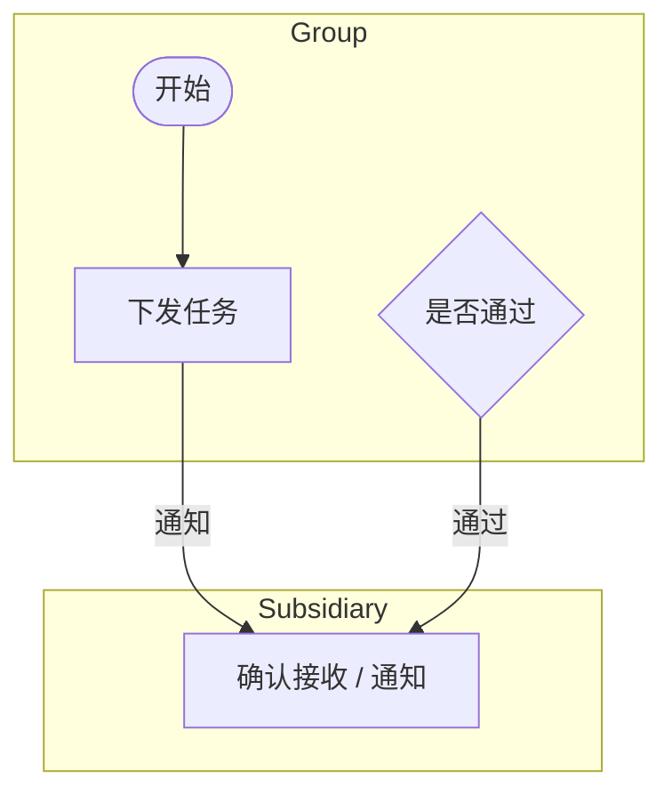

# drawio-digest

Extract the structure of a `.drawio` diagram as **Mermaid** or **JSON**.

`.drawio` files are XML, but they are XML describing a *canvas* — shapes and
coordinates, not meaning. That makes them awkward to diff in review, and
opaque to scripts and LLMs. `drawio-digest` reads the geometry and recovers
the structure: nodes, edges, labels, and lanes.

```bash
drawio-digest flow.drawio              # -> flow.md   (Mermaid)
drawio-digest flow.drawio -f json      # -> flow.json
drawio-digest *.drawio -o docs/        # batch
```

## Why not just read the XML?

Because draw.io is a free-form canvas, several things that look structural on
screen are not structural in the file. This tool handles the cases that bite:

| In the file | What it means | What naive parsing does |
|---|---|---|
| A large titled rectangle | A swimlane | Emits it as a giant node |
| A `vertex` with `edgeLabel` style | A label *on an edge* | Emits a floating node, edge loses its label |
| An edge with no `source` | Endpoint dropped on a connection point, not inside the shape — **looks attached on screen** | Silently loses the edge |
| `endArrow=none` | A divider or annotation | Emits a phantom connection |

The third one is the nasty one. draw.io renders it identically to a real
connection, so it is invisible until something tries to read the file.
`drawio-digest` reattaches such an endpoint when the stored coordinate lies
on or within `20px` of a shape, and **flags it for review** rather than
fixing it silently:

```
> ℹ️ 以下连线端点未真正吸附到节点，已按坐标就近还原，请确认：
> - 下发考核任务 -> 管理员确认接收 通知 (通知)
```

If an endpoint is too far from anything to be certain, the edge is **dropped
and reported** — never guessed:

```
> ⚠️ 以下连线端点悬空，无法确定目标，已跳过，请人工核对：
> - 提交给集团 -> ?
```

The right fix is in the source diagram: drag the endpoint until the *whole
shape* highlights, not just a connection point. This tool tells you where.

## Install

```bash
pip install drawio-digest
```

Requires Python 3.8+. No dependencies.

## Usage

```
drawio-digest FILES... [options]

  -f, --format {mermaid,json}   output format (default: mermaid)
  -o, --outdir DIR              output directory (default: alongside source)
      --stdout                  print instead of writing files
      --direction {TD,LR,BT,RL} mermaid flow direction (default: TD)
      --no-notes                omit review notes about recovered/dropped edges
      --strict                  exit non-zero if any edge was dropped
```

`--strict` is for CI — fail the build when a diagram contains connections
that cannot be resolved.

### As a library

```python
from drawio_digest import parse, to_mermaid

diagram = parse("flow.drawio")
for page in diagram.pages:
    print(page.name, len(page.nodes), len(page.edges))
    for edge in page.recovered:
        print("check this one:", edge.source, "->", edge.target)

print(to_mermaid(diagram, direction="LR"))
```

## Output

Lanes become `subgraph` blocks; rhombus and ellipse shapes are preserved:

````markdown
# flow


````

Multi-page diagrams produce one `##` section and one fenced block per page.

## Limitations

Mermaid is a constrained, auto-laid-out language and draw.io is not, so some
loss is unavoidable and intentional:

- **Layout is not preserved.** Mermaid lays out its own graph.
- **Lanes are inferred from geometry**, since real `swimlane` shapes are rare
  in hand-drawn diagrams. A large titled rectangle that is *not* a lane will
  be treated as one.
- Images, custom shapes, and styling beyond node shape are dropped.
- Compressed diagrams are supported, but if a page fails to decompress, save
  it with **File → Properties → Compressed** unchecked.

For anything beyond a flowchart, use `-f json` and build what you need.

## Development

```bash
python -m venv .venv && .venv/bin/pip install -e ".[dev]"
.venv/bin/python -m pytest
```

## License

MIT
