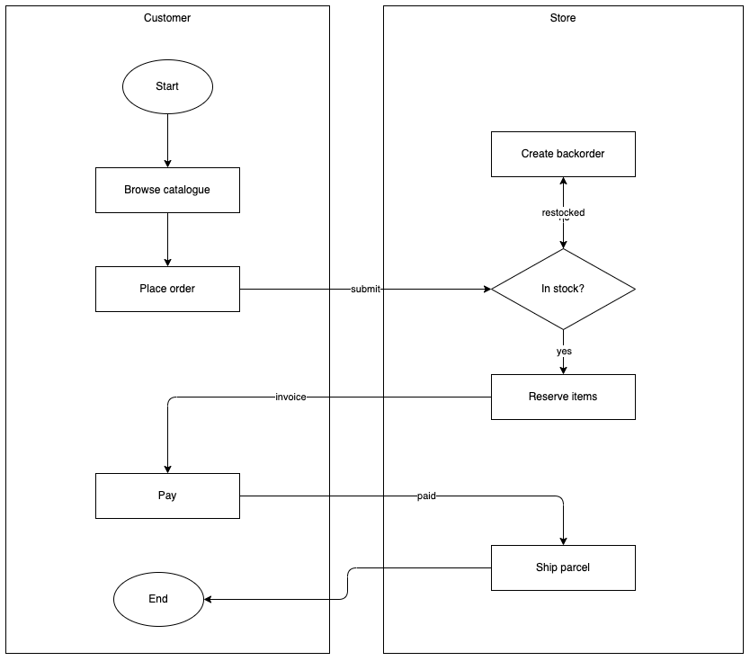

# drawio-digest

**Your `.drawio` diagrams, readable by LLMs — and by humans in code review.**

[中文文档](README.zh-CN.md)

draw.io saves a *canvas* — shapes and coordinates, not meaning. That makes
diagrams opaque to reviewers, scripts and coding agents. `drawio-digest`
reads the geometry and recovers the structure: nodes, edges, labels, lanes.

**What you drew:**

<p align="center">
  
</p>

**What you get** — one command, and GitHub renders the result:

```bash
drawio-digest examples/order-review.drawio
```

```
flowchart TD
    subgraph lane0["Customer"]
        n0(["Start"])
        n1["Browse catalogue"]
        n2["Place order"]
        n3["Pay"]
        n4(["End"])
    end
    subgraph lane1["Store"]
        n5{"In stock?"}
        n6["Reserve items"]
        n7["Create backorder"]
        n8["Ship parcel"]
    end

    n0 --> n1
    n1 --> n2
    n2 -->|"submit"| n5
    n5 -->|"yes"| n6
    n5 -->|"no"| n7
    n6 -->|"invoice"| n3
    n3 -->|"paid"| n8
    n8 --> n4
    n7 -->|"restocked"| n5
```

That diagram is not an image — it is the actual output, a Markdown file with
a fenced Mermaid block per page, rendered by GitHub. Lanes become `subgraph`
blocks, rhombus and ellipse shapes are preserved, and edge labels survive
whether they are stored on the edge or as separate `edgeLabel` cells. Node
numbering is stable, so regenerated output stays diffable.

## Use it with a coding agent

`drawio-digest` is a plain CLI, so Claude Code, Codex and friends can run it
without a plugin or MCP server. Two lines in your project instructions
(`CLAUDE.md`, `AGENTS.md`) are enough:

```markdown
Diagrams under docs/ are .drawio files. Read one with
`drawio-digest <file> --stdout`; scan them all with `drawio-digest docs/*.drawio --summary`.
```

An agent that previously saw only coordinate XML now reads your diagrams like
any other document. `--summary` keeps the cheap case cheap — it answers
*"is this diagram worth opening?"* in a few lines:

```
$ drawio-digest examples/*.drawio --summary
order-review
Page 1: 9 nodes, 9 edges, 2 lanes
  lanes: Customer(5), Store(4)
  entry: Start
  exit: End
```

## Why not just read the XML?

Because the file describes pixels, not meaning. The diagram above is stored
like this:

```xml
<mxCell id="start" value="Start" style="ellipse;whiteSpace=wrap;html=1;" parent="1" vertex="1">
  <mxGeometry x="170" y="100" width="100" height="60" as="geometry" />
</mxCell>
<mxCell id="browse" value="Browse catalogue" style="rounded=0;whiteSpace=wrap;html=1;" parent="1" vertex="1">
  <mxGeometry x="140" y="220" width="160" height="50" as="geometry" />
</mxCell>
<!-- ...and a few hundred more lines of geometry -->
```

Worse, because draw.io is a free-form canvas, several things that look
structural on screen are not structural in the file. This tool handles the
cases that bite:

| In the file | What it means | What naive parsing does |
|---|---|---|
| A large titled rectangle holding other shapes | A swimlane | Emits it as a giant node |
| A `vertex` with `edgeLabel` style | A label *on an edge* | Emits a floating node, edge loses its label |
| An edge with no `source` | Endpoint dropped on a connection point, not inside the shape — **looks attached on screen** | Silently loses the edge |
| `endArrow=none` | A divider or annotation | Emits a phantom connection |

The third one is the nasty one. draw.io renders it identically to a real
connection, so it is invisible until something tries to read the file.
`drawio-digest` reattaches such an endpoint when the stored coordinate lies
on or within `20px` of a shape, and **flags it for review** rather than
fixing it silently:

```
> ℹ️ These connections were not bound to a shape in the source file and were
> reattached by coordinate. Please verify:
> - Place order -> In stock? (submit)
```

If an endpoint is too far from anything to be certain, the edge is **dropped
and reported** — never guessed:

```
> ⚠️ These connections have an unattached endpoint that could not be resolved
> and were skipped. Please check them:
> - Ship parcel -> ?
```

The right fix is in the source diagram: drag the endpoint until the *whole
shape* highlights, not just a connection point. This tool tells you where.

## Install

```bash
pip install drawio-digest
```

Requires Python 3.8+. No dependencies.

## Usage

```
drawio-digest FILE... [options]        # FILE may be - for stdin

  -f, --format {markdown,mermaid,json}  output format (default: markdown)
  -o, --outdir DIR                      output directory (default: alongside source)
      --stdout                          print instead of writing files
      --summary                         short overview instead of converting
      --direction {TD,LR,BT,RL}         mermaid flow direction (default: TD)
      --no-notes                        omit notes about recovered/dropped edges
      --strict                          exit non-zero if any edge was dropped
```

```bash
drawio-digest flow.drawio              # -> flow.md    Markdown + Mermaid
drawio-digest flow.drawio -f mermaid   # -> flow.mmd   bare diagram source
drawio-digest flow.drawio -f json      # -> flow.json  structured data
drawio-digest *.drawio --summary       # one short block per diagram
cat flow.drawio | drawio-digest -      # stdin
```

**Formats.** `markdown` is a ready-to-read document — a `# title`, a fenced
mermaid block per page, and any review notes. `mermaid` is the bare diagram
source, for pasting into a document you already have. `json` is the full
model, for scripts.

**`--summary`** reports nodes that touch no edge as `unconnected` rather than
counting them as entry and exit points — legends and date markers are common
in real diagrams and would otherwise misdescribe the flow.

**`--strict`** is for CI: fail the build when a diagram contains connections
that cannot be resolved.

### As a library

```python
from drawio_digest import parse, parse_string, to_markdown, to_summary

diagram = parse("flow.drawio")
for page in diagram.pages:
    print(page.name, len(page.nodes), len(page.edges))
    for edge in page.recovered:
        print("check this one:", edge.source, "->", edge.target)

print(to_summary(diagram))
print(to_markdown(diagram, direction="LR"))

diagram = parse_string(xml_text)          # already in memory
```

## Features

<details>
<summary><b>Output</b></summary>

- [x] Markdown document — a title, a fenced mermaid block per page, review notes
- [x] Bare Mermaid source, for embedding in a document you already have
- [x] JSON, for scripts and further processing
- [x] `--summary` — shape, lanes, entry/exit points in a few lines
- [x] `--direction TD|LR|BT|RL` for Mermaid flow direction
- [x] Multi-page diagrams — one section and one block per page

</details>

<details>
<summary><b>Structure recovery</b></summary>

- [x] Lanes detected by containment, including plain rectangles used as lanes
- [x] Explicit `swimlane` shapes
- [x] Flat diagrams with no lanes at all
- [x] Node shapes — box, diamond, ellipse
- [x] Edge labels stored inline *or* as separate `edgeLabel` cells
- [x] Endpoints that look attached but are not, reattached by coordinate and flagged
- [x] Unresolvable endpoints reported, never guessed
- [x] `endArrow=none` dividers and unconnected annotations excluded from the flow
- [x] Compressed (deflated) `.drawio` files

</details>

<details>
<summary><b>Interface</b></summary>

- [x] Batch conversion, with `-o` to redirect output
- [x] `-` reads from stdin, `--stdout` prints instead of writing
- [x] `--strict` exits non-zero when an edge could not be resolved, for CI
- [x] Stable node numbering, so regenerated output stays diffable
- [x] Python API — `parse`, `parse_string`, `to_markdown`, `to_mermaid`, `to_json`, `to_summary`
- [x] Zero dependencies, Python 3.8+

</details>

<details>
<summary><b>Not done</b></summary>

- [ ] Sequence, class and ER diagrams — flowcharts only
- [ ] Layout, colours and styling beyond node shape
- [ ] Images and custom shape libraries
- [ ] Nested lanes — an inner lane is dropped and its nodes fall to the outer one
- [ ] Writing `.drawio` back out — this tool only reads

</details>

## Limitations

Mermaid is a constrained, auto-laid-out language and draw.io is not, so some
loss is unavoidable and intentional:

- **Layout is not preserved.** Mermaid lays out its own graph.
- **Lanes are optional.** Flat diagrams convert fine and simply produce no
  `subgraph` blocks.
- **Lanes are inferred from geometry**, since real `swimlane` shapes are rare
  in hand-drawn diagrams. A shape counts as a lane when it has a title *and*
  encloses at least three other shapes — size alone misclassifies both ways,
  because a narrow lane in one diagram can be smaller than a plain box in
  another. Explicit `swimlane` shapes are always honoured.
- Images, custom shapes, and styling beyond node shape are dropped.
- Compressed diagrams are supported, but if a page fails to decompress, save
  it with **File → Properties → Compressed** unchecked.

For anything beyond a flowchart, use `-f json` and build what you need.

## Development

```bash
python -m venv .venv && .venv/bin/pip install -e ".[dev]"
.venv/bin/python -m pytest
```

## License

MIT
