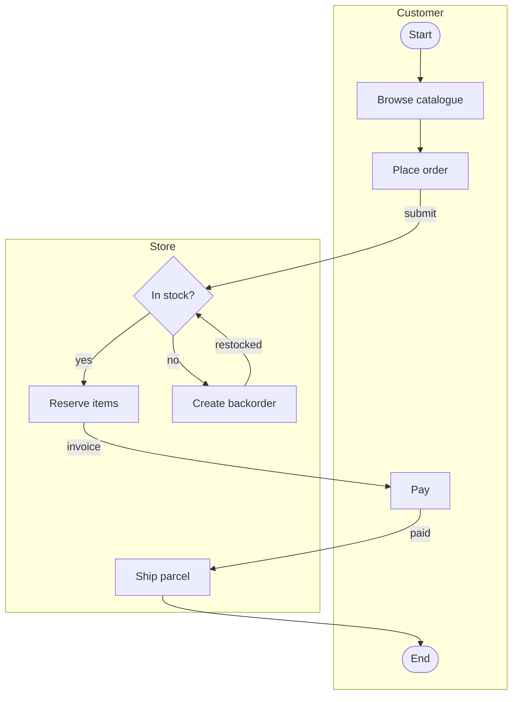

# drawio-digest

把 `.drawio` 图的结构提取成 **Markdown**、**Mermaid** 或 **JSON**。

`.drawio` 文件本身是 XML，但它描述的是*画布*——形状和坐标，不是含义。这导致它
在 code review 里没法看 diff，对脚本和大模型来说也是个黑盒。`drawio-digest`
读取几何信息，还原出真正的结构：节点、连线、标签和泳道。

```bash
drawio-digest flow.drawio              # -> flow.md    Markdown + Mermaid
drawio-digest flow.drawio -f mermaid   # -> flow.mmd   纯图源码
drawio-digest flow.drawio -f json      # -> flow.json  结构化数据
drawio-digest *.drawio --summary       # 每张图输出一段简介
cat flow.drawio | drawio-digest -      # 从标准输入读
```

它就是个普通 CLI，所以你和编程 agent 都能用——Claude Code、Codex 这类工具本来
就会执行 shell 命令，不需要额外装插件或做集成。

[English](README.md)

## 功能

**输出**

- [x] Markdown 文档——标题 + 每页一个 mermaid 代码块 + 审查提示
- [x] 纯 Mermaid 源码，便于嵌进已有文档
- [x] JSON，供脚本和后续处理使用
- [x] `--summary`——用几行给出规模、泳道、起止节点
- [x] `--direction TD|LR|BT|RL` 控制 Mermaid 流向
- [x] 多页图——每页一个小节、一个代码块

**结构还原**

- [x] 按包含关系识别泳道，普通矩形画的泳道也能认出来
- [x] 支持显式 `swimlane` 图形
- [x] 支持完全没有泳道的平铺图
- [x] 节点形状——矩形、菱形、椭圆
- [x] 连线标签，无论是写在线上还是存成独立的 `edgeLabel` 单元
- [x] 看着连上了其实没绑定的端点，按坐标还原并标记出来
- [x] 实在还原不了的端点如实报告，绝不瞎猜
- [x] `endArrow=none` 分隔线、孤立标注框不计入流程
- [x] 压缩（deflate）过的 `.drawio` 文件

**接口**

- [x] 批量转换，`-o` 可指定输出目录
- [x] `-` 从标准输入读，`--stdout` 直接打印不写文件
- [x] `--strict` 在有连线无法还原时返回非零退出码，供 CI 用
- [x] 节点编号稳定，重新生成后 diff 依然可读
- [x] Python API——`parse`、`parse_string`、`to_markdown`、`to_mermaid`、`to_json`、`to_summary`
- [x] 零依赖，Python 3.8+

**未实现**

- [ ] 时序图、类图、ER 图——目前只支持流程图
- [ ] 布局、颜色，以及节点形状之外的样式
- [ ] 图片和自定义图形库
- [ ] 嵌套泳道——内层泳道会被丢弃，其中的节点归到外层
- [ ] 反向写回 `.drawio`——本工具只读

## 为什么不能直接读 XML

因为 draw.io 是自由画布，好几种在屏幕上看着是结构的东西，在文件里并不是。这些
坑都是在真实图纸里踩到的：

| 文件里的样子 | 实际含义 | 直接解析会怎样 |
|---|---|---|
| 一个带标题、装着其他图形的大矩形 | 泳道 | 当成一个巨大的节点 |
| 带 `edgeLabel` 样式的 `vertex` | 挂在*连线上*的标签 | 变成一个游离节点，连线丢失标签 |
| 没有 `source` 的连线 | 端点落在了连接点上而不是图形内部——**画面上完全看不出来** | 静默丢边 |
| `endArrow=none` | 分隔线或标注 | 凭空多出一条连接 |

第三条是最阴险的。draw.io 渲染出来和真正连上的线**一模一样**，只有等到有程序去
读它时才会暴露。`drawio-digest` 的做法是：当存下来的坐标落在某个图形上或
`20px` 以内时按坐标还原，并且**标记出来让人确认**，而不是悄悄改掉：

```
> ℹ️ These connections were not bound to a shape in the source file and were
> reattached by coordinate. Please verify:
> - Place order -> In stock? (submit)
```

如果端点离所有图形都太远、无法确定，这条边会被**丢弃并报告**——绝不猜：

```
> ⚠️ These connections have an unattached endpoint that could not be resolved
> and were skipped. Please check them:
> - Ship parcel -> ?
```

真正的修法是在原图里：把端点拖到*整个图形*高亮为止，而不是只有一个小连接点变
色。这个工具会告诉你该去修哪一条。

## 安装

```bash
pip install drawio-digest
```

需要 Python 3.8+，无第三方依赖。

## 用法

```
drawio-digest FILE... [options]        # FILE 可以是 - 表示标准输入

  -f, --format {markdown,mermaid,json}  输出格式（默认 markdown）
  -o, --outdir DIR                      输出目录（默认与源文件同级）
      --stdout                          打印到标准输出而不写文件
      --summary                         只输出简介，不做转换
      --direction {TD,LR,BT,RL}         mermaid 流向（默认 TD）
      --no-notes                        不输出还原/丢弃连线的提示
      --strict                          有连线被丢弃时返回非零退出码
```

**三种格式的用途。** `markdown` 是拿来就能读的文档——一个 `# 标题`、每页一个
mermaid 代码块，以及审查提示。`mermaid` 是纯图源码，适合贴进你已有的文档。
`json` 是完整模型，供脚本使用。

**`--summary`** 回答的是*「这张图值不值得打开」*，扫一个仓库时先跑它最划算：

```
$ drawio-digest examples/*.drawio --summary
order-review
Page 1: 9 nodes, 9 edges, 2 lanes
  lanes: Customer(5), Store(4)
  entry: Start
  exit: End
```

没有任何连线的节点会被单独报成 `unconnected`，而不是既算入口又算出口——真实图纸
里常有图例、时间标注这类孤立方框，否则会把流程描述错。

**`--strict`** 是给 CI 用的：图里存在无法还原的连线时让构建失败。

### 作为库使用

```python
from drawio_digest import parse, parse_string, to_markdown, to_summary

diagram = parse("flow.drawio")
for page in diagram.pages:
    print(page.name, len(page.nodes), len(page.edges))
    for edge in page.recovered:
        print("这条需要确认:", edge.source, "->", edge.target)

print(to_summary(diagram))
print(to_markdown(diagram, direction="LR"))

diagram = parse_string(xml_text)          # 内容已在内存里
```

## 输出示例

`examples/order-review.drawio` 是一个两泳道的订单流程。运行
`drawio-digest examples/order-review.drawio` 得到：

````markdown
# order-review


````

泳道变成 `subgraph`，菱形和椭圆形状会保留，连线标签无论存在线上还是存成独立的
`edgeLabel` 单元都能取到。多页图会输出多个 `##` 小节，每页一个代码块。

节点编号按泳道逐个分配，而不是按 XML 文档顺序，所以改动图的一部分不会导致其余
节点全部重新编号——重新生成后的 diff 依然干净。

## 局限

Mermaid 是一种受约束、自动布局的语言，draw.io 不是，所以有些信息的丢失是必然的，
也是有意为之：

- **不保留布局。** Mermaid 会自己排版。
- **泳道是可选的。** 平铺的图一样能转，只是不生成 `subgraph`。
- **泳道靠几何推断**，因为手画的图很少用真正的 `swimlane` 图形。判定条件是：有
  标题**且**圈住至少三个其他图形——只看大小两个方向都会误判，毕竟一张图里窄窄的
  泳道，可能比另一张图里的普通方框还小。显式 `swimlane` 样式则永远认。
- 图片、自定义图形，以及节点形状之外的样式都会被丢弃。
- 支持压缩过的图；万一某页解压失败，在 draw.io 里取消勾选
  **File → Properties → Compressed** 后另存即可。

流程图之外的需求，建议用 `-f json` 拿到完整模型自己处理。

## 开发

```bash
python -m venv .venv && .venv/bin/pip install -e ".[dev]"
.venv/bin/python -m pytest
```

## License

MIT
